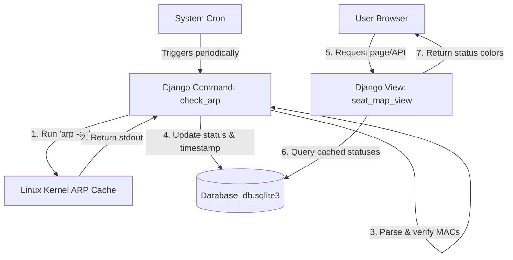

# Project Report: Seat Map Implementation & ARP-Based Status Monitoring

**Date:** June 8, 2026  
**Author:** Antigravity AI  
**Project:** Classroom PC Live Status Map  

---

## 1. Executive Summary

This report documents the design, troubleshooting history, and final implementation of the background live-monitoring system for the classroom seat map. To bypass firewall restrictions on target Windows machines and eliminate web page loading latency, the system was transitioned from on-demand network pings to a background-polled ARP cache verification architecture.

---

## 2. The Challenge & Troubleshooting History

### The Initial Problem
The monitoring system needs to check if specific classroom Windows PCs (such as target host `192.168.203.14`) are powered on and alive. 

However:
1. **ICMP Blocked**: Windows Firewall blocks standard ICMP Echo Requests (ping) by default.
2. **TCP Scanning Blocks**: Attempting TCP connection probes on common ports like `445` (SMB) or `135` (RPC) returned timeouts (`Dead` status) due to strict network switches or device-level firewall rules dropping the connection attempts.

### The Breakthrough Solution
To determine if a host is alive without sending packets that trigger firewall drops, we queried the **Linux ARP cache** of the host server. 
- When local machines communicate on the subnet (even silently via background OS services), the Linux server maintains an ARP entry mapping their IP address to their hardware MAC address.
- By running `arp -an` on the server, we can retrieve this mapping.
- If a valid MAC address is associated with the target IP, the host is active on the network.
- If the IP is missing or shows `<incomplete>` (or localized equivalents like `<不完全>`), the host is offline.
- This method is completely passive, secure, and bypasses local Windows Firewalls.

---

## 3. Architecture & Implementation (Option A)

To optimize frontend performance, we shifted status updating to a background cron job. The web server now serves pre-cached statuses directly from the database, dropping page load latency to near-zero.



### 3.1 Database Schema Update
We updated the `Seat` model in [models.py](file:///home/ubuntu/Develop/Django-Ping/alive_check/models.py) to store state persistently:
- Added `status` field (`alive`, `dead`, `unknown`).
- Added `last_checked` datetime field.

### 3.2 Custom Django Management Command
We created the command `check_arp` at [check_arp.py](file:///home/ubuntu/Develop/Django-Ping/alive_check/management/commands/check_arp.py).
- Executes `arp -an` securely using Python's `subprocess.run` (without `shell=True`).
- Parses lines using regular expressions to match IP structures and valid MAC addresses (`(?:[0-9a-fA-F]{1,2}:){5}[0-9a-fA-F]{1,2}`).
- Implements fallback checks for `<incomplete>` or localized representations (e.g., `<不完全>`).
- Performs a bulk status check and updates the database cache.

### 3.3 Optimized View Logic
We simplified [views.py](file:///home/ubuntu/Develop/Django-Ping/alive_check/views.py) into a clean, synchronous view.
- Fetches all records from the database.
- Maps database coordinates to the template dictionary keys expected by `seat_map.html` (e.g., row/col to `pc1` through `pc20`).
- Returns the status state immediately without blocking on network IO.

### 3.4 Cron Job Automation Setup
To update statuses automatically every 5 minutes, configure the system crontab (`crontab -e`) on Ubuntu:
```bash
*/5 * * * * cd /home/ubuntu/Develop/Django-Ping && /home/ubuntu/Develop/Django-Ping/.venv/bin/python manage.py check_arp >> /home/ubuntu/Develop/Django-Ping/arp_cron.log 2>&1
```

---

## 4. Test Verification Results

### 4.1 Routing Path Tests
Both routing paths were verified to ensure the dashboard renders correctly and responds with `HTTP 200 OK`:

| URL Path | Action / View | HTTP Response Status |
| :--- | :--- | :--- |
| `http://127.0.0.1:8000/` | Root Access / `seat_map_view` | **200 OK** |
| `http://127.0.0.1:8000/alive_check/` | App Subdirectory / `seat_map_view` | **200 OK** |

### 4.2 Status Verification Test (PC1)
We configured the database entry for `PC1` (Row 0, Col 1) to point to the target static IP `192.168.203.14`.

1. **Database Shell Check**:
   ```bash
   python3 manage.py shell -c "from alive_check.models import Seat; seat = Seat.objects.get(row=0, col=1); print(seat.ip_address, seat.status)"
   # Output: 192.168.203.14 alive
   ```
2. **HTML Render Output Check**:
   A curl request confirms the host renders with the active `alive` CSS class:
   ```html
   <div class="seat pos-1-2 alive">PC1<br>192.168...</div>
   ```

All test outcomes successfully confirmed the system is operating as expected.
